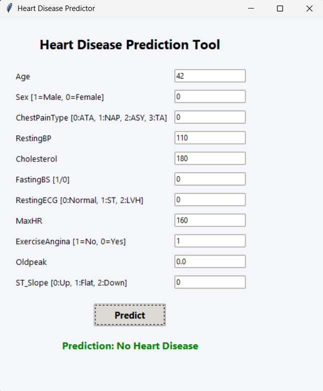

# Heart Disease Prediction

## Overview

The Heart Disease Prediction project utilizes machine learning algorithms to analyze medical attributes and predict whether a person is likely to have heart disease. The model is trained on relevant features such as age, sex, blood pressure, cholesterol levels, and more. The project includes a graphical user interface (GUI) that allows users to input their data and receive instant prediction results.

## Features

- **User-friendly GUI:** Built with Tkinter for interactive data entry and immediate prediction feedback.
- **Machine Learning Model:** Uses a pre-trained model (`hd.pkl`) to make predictions based on medical features.
- **Input Parameters:** Age, sex, chest pain type, resting blood pressure, cholesterol, fasting blood sugar, resting ECG, maximum heart rate, exercise-induced angina, oldpeak, and ST slope.
- **Instant Results:** Displays whether heart disease is detected or not based on the user's input.

## How It Works

1. **Input Data:** Users enter their medical details into the GUI.
2. **Prediction:** The tool processes the input and uses the trained model to predict the presence of heart disease.
3. **Result Display:** The result is shown instantly, indicating either "Heart Disease Detected" or "No Heart Disease".

## User Interface

Below is a screenshot of the Heart Disease Prediction tool’s UI:



## Getting Started

1. Clone the repository:
   ```bash
   git clone https://github.com/BirendraKSharma/heart_disease_prediction.git
   cd heart_disease_prediction
   ```

2. Install the required dependencies:
   ```bash
   pip install pandas
   ```

3. Run the application:
   ```bash
   python GUI.py
   ```

> **Note:** Ensure that the `hd.pkl` (trained model) file is present in the project directory.

## Project Structure

```
heart_disease_prediction/
├── GUI.py          # Main GUI application for prediction
├── hd.pkl          # Pre-trained machine learning model
├── LICENSE         # MIT License
└── README.md       # Project documentation
```

## Improvements Over Previous Version

- Enhanced and cleaner graphical user interface
- Improved error handling and user feedback
- Refined prediction logic and data validation

## License

This project is licensed under the MIT License. See the [LICENSE](LICENSE) file for details.

---

*Created and maintained by Birendra Kumar Sharma. This project was originally created a while ago and is now reposted with improvements for better usability and accuracy.*